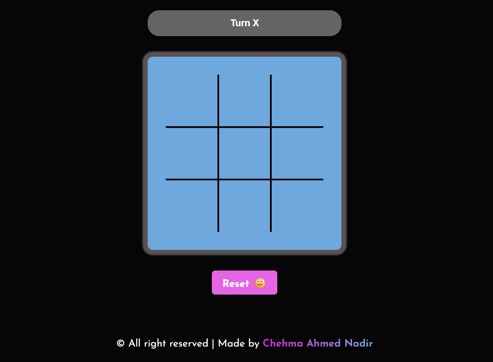

# 🎮 Tic Tac Toe Game

A simple and interactive **Tic Tac Toe** game built with **HTML**, **CSS**, and **JavaScript**. This classic game allows two players (X and O) to compete on a 3x3 grid, with win detection, draw handling, and sound effects.

---

## 📸 Preview

---

## 🚀 Features

- 🔁 Alternating turns between player X and O
- 🧠 Win and draw detection
- 🔊 Sound effects for win and draw
- 🎨 Highlight winning cells
- 🧼 Reset game button
- 📱 Responsive and clean UI

---

## 🛠️ Technologies Used

- HTML5
- CSS3
- JavaScript (Vanilla)

---

## 🧩 How to Play

1. Click on an empty cell to mark your symbol (X or O).
2. Players alternate turns.
3. First to complete 3 symbols in a row (horizontally, vertically, or diagonally) wins.
4. If all cells are filled with no winner, the game ends in a draw.

